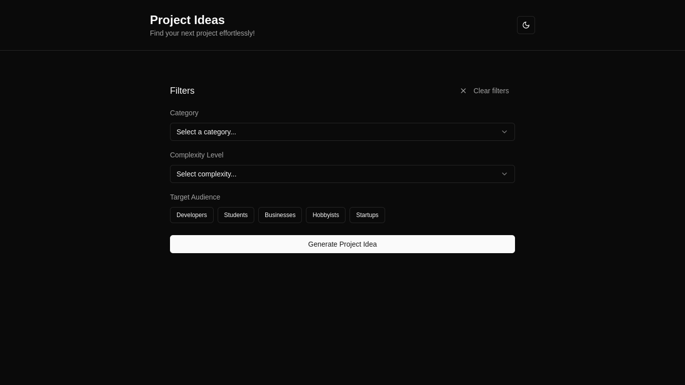

# Project Ideas Generator



## Introducing

An app that generates project ideas based on user preferences with customizable filters.


## Features

- Choose a Category
- Select a Tech Stack
- Set Your Experience Level
- Define Target Audience


## 🔧 Installation

Using Docker:

- Run the following command to build the Docker image:

```bash
docker build -t sidharthh/project-ideas .
```
- Run the Docker Container
```bash
docker run -p 3000:3000 sidharthh/project-ideas
```

Access the Application
  ```bash 
http://localhost:3000
  ```
---
Without Docker:

Follow these steps to set up the app locally:

1. Clone the repository:
   ```bash
   git clone https://github.com/notcodesid/project-ideas.git
   ```

2. Navigate to the project directory:
   ```bash
   cd project-ideas
   ```

3. Install dependencies:
   ```bash
   npm install
   ```

4. Start the development server:
   ```bash
   npm run dev
   ```

5. Open your browser and navigate to `http://localhost:3000`.
